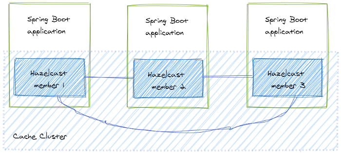
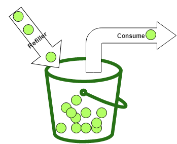
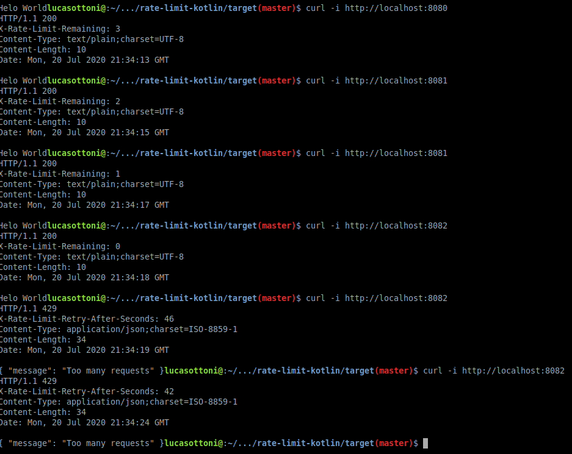
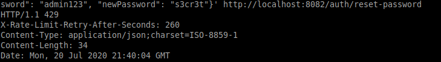

# rate-limit-kotlin
Rate limit Kotlin with Spring Boot

Este projeto é uma cópia adaptada do projeto feito pelo Christiano Guedes no [GitHub](https://github.com/christianoguedes/rate-limit-java)

O artigo original pode ser encontrado [aqui](https://medium.com/coreshield/backend-seguro-rate-limit-com-spring-boot-em-m%C3%BAltiplas-inst%C3%A2ncias-bfe979b2e7e9)

Apenas criei uma versão para adaptar e exemplificar em kotlin e para fácil acesso de pesquisa pessoal.

# Conhecendo o Hazelcast: Dados distribuídos
O **Hazelcast** é uma ferramenta open-source focada em computação distribuída e é feita em Java. Isso mesmo, através de um pequeno jar na dependência do projeto temos uma maneira muito simples de distribuir o processamento de dados entre os nós.

Os dados ficam compartilhados em memória entre todas as instâncias da aplicação através de _maps_, por isso é uma ferramenta muito utilizada para cache compartilhado e com alta performance.

A ferramenta Hazelcast é disponibilizada em duas versões sendo uma _community_ e outra _enterprise_, que possui alguns recursos mais elaborados. Ainda assim, no escopo desse artigo a versão adotada será a _community_, de fácil acesso a todos.

Por padrão e para facilitar a configuração o Hazelcast utiliza UDP para realizar _discovery_ de máquinas na rede e assim adicionar ao cluster automaticamente por multicast, porém se preferir também é possível configurar a comunicação via TCP/IP.

Para o _rate limiting_ implementado neste artigo o Hazelcast será utilizado no escopo de cache em memória para compartilhamento entre os nós do mapa das requisições feitas para cada cliente conforme a topologia abaixo.

`Fonte Imagem: https://reflectoring.io/spring-boot-hazelcast/`

# Conhecendo o Bucket4J: Rate limiting

O **Bucket4J** é uma biblioteca feita em Java que implementa o rate limit através do _token-bucket algorithm_.

`Fonte Imagem: https://golb.hplar.ch/2019/08/rate-limit-bucket4j.html`

Também nesse artigo será utilizada a biblioteca **bucket4j-spring-boot-starter** para uma fácil integração do Bucket4j com o Spring Boot através da configuração de properties.

# Configurando o projeto

## Primeiro passo: Adicionando as dependências no Spring Boot

Conforme dito anteriormente é necessário habilitar o cache do Spring e adicionar o Hazelcast e também o Bucket4J como dependências ao pom.xml do projeto, conforme exemplo do trecho abaixo.

      
        <dependency>
            <groupId>org.springframework.boot</groupId>
            <artifactId>spring-boot-starter-cache</artifactId> 
        </dependency>
        
        <dependency>
            <groupId>com.hazelcast</groupId>
            <artifactId>hazelcast</artifactId>
        </dependency>
        
        <dependency>
            <groupId>com.hazelcast</groupId>
            <artifactId>hazelcast-spring</artifactId>
        </dependency>
        
        <dependency>
            <groupId>com.giffing.bucket4j.spring.boot.starter</groupId>
            <artifactId>bucket4j-spring-boot-starter</artifactId>
            <version>0.2.0</version>
        </dependency>

## Segundo passo: Configuração do cache
Para habilitar o cache no Spring Boot é necessário adicionar em uma classe de configuração a anotação `@EnableCaching`.

        @EnableCaching
        @SpringBootApplication
        class RateLimitApplication

Para o **Hazelcast**, deve-se criar o mapa de cache que será compartilhado entre os nós, através da criação do arquivo **hazelcast.xml** no resources da aplicação.

O valor do XML deve seguir as informações abaixo:
    
    <?xml version="1.0" encoding="UTF-8"?>
    <hazelcast
            xsi:schemaLocation="http://www.hazelcast.com/schema/config http://www.hazelcast.com/schema/config/hazelcast-config.xsd"
            xmlns="http://www.hazelcast.com/schema/config"
            xmlns:xsi="http://www.w3.org/2001/XMLSchema-instance">
    
        <map name="rate-limit">
            <time-to-live-seconds>120</time-to-live-seconds>
            <max-size>20000000</max-size>
        </map>
    
        <cache name="rate-limit">
        </cache>
    
    </hazelcast>

Para que o Spring reconheça o arquivo de configuração do Hazelcast é preciso adicionar no application.properties a propriedade:
`spring.cache.hazelcast.config=classpath:hazelcast.xml`

Já para o Bucket4J funcionar com as versões mais nova do Spring Boot tem que habilitar a sobrecarga de beans de um mesmo qualifier, através da propriedade abaixo:
`spring.main.allow-bean-definition-overriding=true`

## Terceiro passo: Regra padrão do limite de requisições na aplicação por IP
Para a configuração de uma regra default é preciso habilitar algumas propriedades no **application.properties** da aplicação, neste exemplo do artigo temos uma regra de 5 acessos por minuto para um mesmo IP e após excedidas as requisições ocorre um bloqueio de 1 minuto.

## Teste do limite de requisições no 'cluster' da aplicação
Após o **build** realizado com sucesso e para simular um cluster da aplicação na própria máquina local será necessário iniciar várias instâncias da aplicação em portas distintas como no exemplo abaixo:

    Instância 1: java -jar -Dserver.port=8080 rate-limit-kotlin.jar
    Instância 2: java -jar -Dserver.port=8081 rate-limit-kotlin.jar
    Instância 3: java -jar -Dserver.port=8082 rate-limit-kotlin.jar

Para a o teste das requisições serão feitas 6 chamadas entre instâncias (portas) distintas para o endpoint "/" em um intervalo de menos de 1 minuto.

## Quarto passo: Regra de limite com validação usando Beans e regex por URL (opcional)

Além da restrição de acesso de todos os endpoints da aplicação por IP é possível limitar especificamente algumas URLs para um bloqueio mais restritivo. É muito útil para recursos mais sensíveis, por exemplo nos serviços vinculados à autenticação para evitar tentativa de força bruta, através da regex da propriedade do exemplo:
`bucket4j.filters[0].url=/auth/.*`

Também é possível com o Bucket4J bloquear um usuário com muitos acessos mesmo tendo IPs distintos, através da utilização da execução de beans. Exemplo da propriedade: `bucket4j.filters[0].rate-limits[0].expression`

É importante observar que o Bucket4J tem uma configuração padrão que a primeira regra encontrada será a utilizada, portanto é recomendado colocar a regra global como sendo a de menor prioridade e para isso é preciso renomear as propriedades iniciadas por `bucket4j.filters[0]` para `bucket4j.filters[1]`.

A simulação do teste é exatamente igual a etapa anterior, apenas trocando o endpoint final.
Exemplo de requisição:

    curl -i -H "Content-Type: application/json" -X POST -d '{"oldPassword": "admin123", "newPassword": "s3cr3t"}' http://localhost:8080/auth/reset-password
    
Na quarta execução é bloqueado por 5 minutos conforme regra especificada no properties.

## Quinto passo: Métricas de bloqueios (opcional)
Com o Bucket4j é possível obter métricas dos acessos negados pelo rate limiting através do **Actuator** que juntamente com o **Prometheus** pode criar um painel dashboard em um **Grafana** para monitorar e gerar alertas sobre tentativas de acessos indevidos ou possíveis tentativas de ataque ao sistema.

O foco deste artigo é apenas a liberação dos dados do Bucket4j com o Actuator, mas para entender como configurar o Prometheus com o Grafana no Spring Boot veja a recomendação de leitura [aqui](https://www.callicoder.com/spring-boot-actuator-metrics-monitoring-dashboard-prometheus-grafana/).

Para habilitar o Actuator deve adicionar a dependência no pom.xml conforme exemplo abaixo:

    <dependency>
        <groupId>org.springframework.boot</groupId>
        <artifactId>spring-boot-starter-actuator</artifactId>
    </dependency>

E também no application.properties deve adicionar a seguinte configuração:
    
    #metrics - habilitar todos os endpoints do actuator 
    management.endpoints.web.exposure.include=*
    management.endpoint.prometheus.enabled=true
    
    #metricas - /actuator/metrics/bucket4j_summary_consumed
    bucket4j.filters[0].metrics.enabled=true   
    bucket4j.filters[0].metrics.types=REJECTED_COUNTER    
    bucket4j.filters[0].metrics.tags[0].key=IP   
    bucket4j.filters[0].metrics.tags[0].expression=getRemoteAddr()  
    bucket4j.filters[0].metrics.tags[0].types=REJECTED_COUNTER  
    bucket4j.filters[0].metrics.tags[1].key=URL   
    bucket4j.filters[0].metrics.tags[1].expression=getRequestURI()   

Resposta do actuator metrics:

    {
        "name":"bucket4j_summary_rejected",
        "description":null,
        "baseUnit":null,
        "measurements":[{"statistic":"COUNT","value":1.0}],
        "availableTags":[
            {"tag":"IP","values":["127.0.0.1"]},
            {"tag":"name","values":["rate-limit"]},
            {"tag":"URL","values":["/auth/reset-password"]}
        ]
    }

# Conclusão
O Rate Limiting é uma técnica essencial para proteger qualquer sistema e o Bucket4J juntamente com o Hazelcast são uma 
alternativa simples para o Spring Boot sem ter que "poluir" o código, 
nem ter que alterar nenhuma regra de negócio e são também de fácil escalabilidade em instâncias distribuídas.

Também é possível ter um grande poder de personalização das regras de bloqueios com a execução dos beans, 
algo que normalmente não é possível em um rate limiting externo a aplicação.

É sempre importante levar em conta que a cyber segurança é composta por camadas e 
o rate limiting é apenas uma dessas etapas e técnicas. 
Portanto é recomendado que a aplicação tenha outras medidas como por exemplo bloqueio por captcha nas 
retentativas de autenticação e na recuperação de senha.

### Referências para aprender mais

[Hazelcast usado como cache no Spring](https://reflectoring.io/spring-boot-hazelcast)

[Bucket4J com Spring MVC](https://golb.hplar.ch/2019/08/rate-limit-bucket4j.html)

[Bucket4J Starter para Spring Boot](https://github.com/MarcGiffing/bucket4j-spring-boot-starter)

[Métricas com uso do Actuator, Prometheus e Grafana no Spring Boot](https://www.callicoder.com/spring-boot-actuator-metrics-monitoring-dashboard-prometheus-grafana/)

[Rate Limiting para NGINX](https://www.nginx.com/blog/rate-limiting-nginx/)

